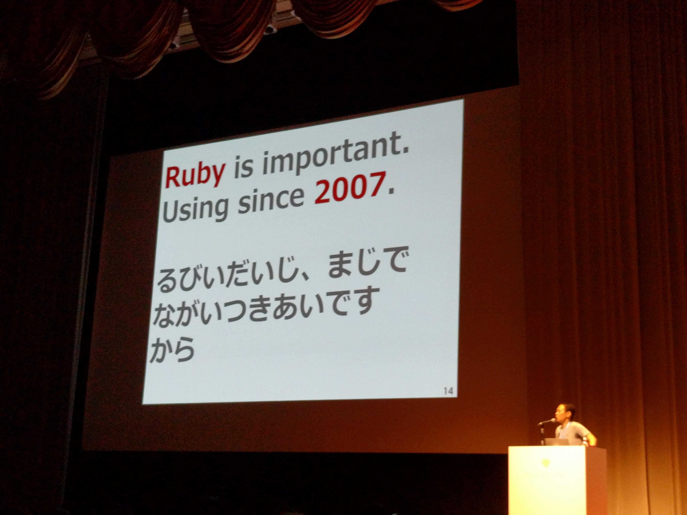

% RubyKaigi 2017行ってきた
% yamotonalds
% 2017-09-25

#

##


##


## RubyKaigi 2017

- 広島
- 9/18〜20

##

9/18

##

広島東洋カープ優勝

## 街はカープ一色


## 看板も即貼替え


## 夜でも大騒ぎ


## カープが好きなフレンズ


## 会場


## 世界中から


## スポンサー


## 難しい


## 技術の話を




## してました


#

## 🐼が見たセッション - 1日目

- Keynote - nobu (A)
- API Development in 2017 (B)
- How Close is Ruby 3x3 For Production Web Apps? (A)
- Gemification for Ruby 2.5/3.0 (B)
- Hanami - New Ruby Web Framework (C)
- Development of Data Science Ecosystem for Ruby (A)
- Ruby Committers vs the World (A)

## 🐼が見たセッション - 2日目

- Keynote - matz (A)
- An introduction and future of Ruby coverage library (A)
- The Curious Case of Wikipedia Parsing (C)
- Regular Expressions Inside Out (B)
- Type Checking Ruby Programs with Annotations (A)
- Ruby Language Server (B)
- Lightning Talks (A)

## 🐼が見たセッション - 3日目

- Compacting GC in MRI (A)
- Ruby for Distributed Storage System (B)
- Bundler 2 (C)
- Memory Fragmentation and Bloat in Ruby (C)
- Busting Performance Bottlenecks: Improving Boot Time by 60% (C)
- How to write synchronization mechanisms for Fiber (A)
- Towards Ruby 3x3 performance (A)

#

## API Development in 2017

onk ドリコム

RESTを振り返りつつOpenAPI(Swagger)やGraphQLの話を少し。

##

OpenAPIに乗っかったまま、ドリコムでは独自拡張

```
optional -> require
$merge -> $ref
```

Schema記述を楽にする仕組みを作ることでメリットの享受を大きく

##

RESTは思想であって仕様ではないのでブレたり例外があったり、難しい

. . .

Schema First Development

## Gemification for Ruby 2.5/3.0

hsbt GMOペパボ

- 標準ライブラリ
- Default gem
- Bundle gem

について。

## 標準ライブラリ

Rubyに直接入ってるライブラリ

## Default gem

添付されているが、gemとして独立しているもの

- Rubyのバージョンアップをしなくてもgemのバージョンアップだけで脆弱性対応等ができる
    - opensslとか
- GitHubにリポジトリを持って開発してたりして、適当なところでruby本体にbundleされる

## Bundle gem

標準でgem installされているgem

- ユーザーがuninstallできる
- 標準添付する理由はないけど、使ってほしいgem
    - test-unit, rake等
- クロスコンパイル周りが難しい（？）のでC extensionなgemは含めていない

##

Ruby 2.5でbundlerがDefault gemになる

→ `gem install bundler` が不要になる

##

今後、Default gem, Bundle gemを増やしていく

（中の人は大変だけどユーザーを便利に）


## Development of Data Science Ecosystem for Ruby

mrkn Cookpad

PyCallでpythonのライブラリを使える

Kerasを使った「画像から物体の位置を検出する」デモ

## An introduction and future of Ruby coverage library

mametter Cookpad

Coverageには

- Line
- Branch
- Condition
- Path

とかいろいろある

##

SimpleCovはLine Coverage

```
do_somethinhg if condition
```

. . .

Ruby 2.5ではBranch Coverageが測定できるようになる


## Compacting GC in MRI

tenderlove GitHub

GC compacting（メモリ上のRubyオブジェクトの移動）の話

##

processのforkはCopy on Writeだから本来はメモリ消費が少ないはずだけどGCでメモリが書き換わるのでPage Faultsが多くなる

→ メモリ上のRubyオブジェクトを移動させて使用するページを集中させる

##

Rubyの作り上、移動できないもの（リテラルやグローバル変数）が多くて半分くらいのオブジェクトしか移動できない

## Bundler 2

0xColby Marketplacer

Bundler 1の話を少しとBundler 2の話

##

- bundle add <gem名>
    - 既存gemの依存関係を考慮してGemfileにバージョン付きの記述を追加してくれる
- Bundle Plugin
    - bundleのサブコマンドを簡単に作る仕組み
    - `bundle install` 等のhook

##

Bundler 2では

- Ruby 2.2以下のサポートが無くなる
- `bundle` だけはinstallじゃなくhelp表示に
- もろもろ後方互換性無し
- Ruby 2.5からは標準添付

. . .

Bundler 1のGemfile.lockを解釈できる


## Busting Performance Bottlenecks: Improving Boot Time by 60%

jules2689 Shopify

bootsnapの話

- Compiling
- Serializing
- Constant Lookup

## Compiling

Ruby 2.3でAPIが用意され、bytecodeをそのままloadできるようになった

## Serializing

Yaml.load_fileが遅いからMessagePackでcacheするようにした

## Constant Lookup

毎回LOAD_PATH全部から探さずにcacheするようにした

## Towards Ruby 3x3 performance

vnmakarov RedHat

20年くらいGCC触ってた人

MJITというMRI VM用JITでRubyを高速化した話

##

JITの前に、最適化しやすいようにStack型のVM命令をRTL型のVM命令に実装し直した

. . .

それだけで27%くらい速くなるものもあった

##

JITの選択肢として

- Writing own JIT
- Using widely used optimizing compilers
- Using existing JITs

## Writing own JIT

自前で専用のJITを実装する

例: LuaJIT

. . .

portabilityとか考えると実装するのすごく大変

## Using widely used optimizing compilers

広く使われてるコンパイラを使う

例: GCC, LLVM

. . .

portableだけどcompileが遅い

## Using existing JITs

既に存在するJITを使う

例: JRuby, Graal/Truffle

. . .

ライセンスや特許問題がヤバい

##

実装やメンテナンス性を考慮して

「Using widely used optimizing compilers」

を採用した

##

その結果

Optcarrot（Rubyで書かれたファミコンエミュレータ）がメモリ消費ほぼ変わらず3倍速くなった

##

- make testは通るけどmake checkが通らない
- Windowsで動かない
- inline化がまだで、それが一番重要
- まだ1年はかかる

[https://vmakarov.fedorapeople.org/VMakarov-RubyKaigi2017.pdf](https://vmakarov.fedorapeople.org/VMakarov-RubyKaigi2017.pdf)
[https://github.com/vnmakarov/ruby](https://github.com/vnmakarov/ruby)

#

## 感想

- パフォーマンスや型の話が多かった？
    - Annotationコメントがっつりとか書きたくないので型の動向は気になる
    - GCの改善やJITは期待
- Guildの話は無かった
    - どうなるんだろう？ 🤔 

##

- お祭り感がある
- テクい話が聞けてたーのしー
    - GCとかJITの話聞いててたーのしー
    - WebAPIとか普段使いそうなものの話もたーのしー
- スポンサーブースもたーのしー


## 次回のRubyKaigi

- 仙台
    - 日本三景コンプリート
- 2018/5/31（木）〜6/2（土）


